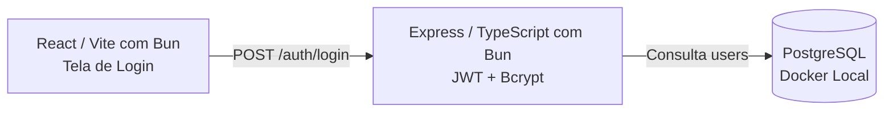

# 🚀 Guia de Execução — Sprint 1: Fundação & Autenticação

> **Para a Squad MesaFácil:** Este documento é o manual oficial de execução da nossa **Sprint 1**.  
> Aqui estão as regras do jogo, a divisão de tarefas, os contratos de API e a meta única que entregaremos funcionando até o fim da semana.

---

## 🎯 1. A Nossa "North Star" (Meta Única da Semana)

O objetivo da Sprint 1 **não é** entregar regras de negócio complexas de restaurantes.  
O nosso único objetivo é provar que a **linha de montagem de software funciona de ponta a ponta**:



> **Critério de Sucesso da Semana:** Qualquer membro (ou o professor) rodar `docker compose up --build`, abrir o navegador, digitar o e-mail de um usuário de teste e entrar no sistema com sucesso.

---

## 👥 2. Divisão de Papéis e Duplas de Trabalho

Para ninguém trabalhar isolado ou ficar travado esperando o outro, atuaremos em **duplas naturais**:

| Integrante | Papel Principal | Foco da Semana | Parceiro Direto |
| :--- | :--- | :--- | :--- |
| **Integrante 1** | **Infra / DevOps** | Docker Compose com Postgres + Dockerfiles base | Banco de Dados |
| **Integrante 2** | **Banco de Dados** | Modelagem da tabela `users` + script de seed inicial | Backend & Infra |
| **Integrante 3** | **Backend** | Setup Express/TS + Conexão com banco + Rota de Login | Banco de Dados |
| **Integrante 4** | **Frontend** | Setup React/Vite + Layout da tela de Login + Chamada HTTP | Decisor (Contratos) |
| **Paulo** | **Tech Lead / PO** | Governança, Code Review dos PRs, Suporte técnico e QA | Toda a Squad |

---

## 🔌 3. Contrato Oficial da API (Contract-First)

> ⚠️ **Atenção Frontend e Backend:** Vocês **não dependem um do outro** para trabalhar. Ambos devem seguir este formato exato:

### Endpoint: `POST /auth/login`

#### 📤 Request (O que o Frontend envia)
* **Headers:** `Content-Type: application/json`
* **Body:**
```json
{
  "email": "garcom@mesafacil.com",
  "password": "123"
}
```

#### 📥 Response de Sucesso (HTTP 200 OK)
```json
{
  "success": true,
  "data": {
    "token": "eyJhbGciOiJIUzI1NiIsInR5cCI6IkpXVCJ9...",
    "user": {
      "id": 1,
      "name": "Carlos Garçom",
      "email": "garcom@mesafacil.com",
      "role": "waiter"
    }
  }
}
```

#### 📥 Response de Erro de Credencial (HTTP 401 Unauthorized)
```json
{
  "success": false,
  "error": "E-mail ou senha incorretos."
}
```

#### 📥 Response de Validação de Campos (HTTP 400 Bad Request)
```json
{
  "success": false,
  "error": "Os campos email e senha são obrigatórios."
}
```

---

## 👤 4. Usuários de Teste Iniciais (Seed Obrigatório do Banco)

O cara do Banco / Backend deve deixar esses 4 usuários pré-cadastrados no banco para os testes do time:

| Nome | E-mail | Senha Padrão | Papel (`role`) |
| :--- | :--- | :--- | :--- |
| **Carlos Atendimento** | `garcom@mesafacil.com` | `123` | `waiter` |
| **Chef Henrique** | `cozinha@mesafacil.com` | `123` | `kitchen` |
| **Ana Operadora** | `caixa@mesafacil.com` | `123` | `cashier` |
| **Mariana Gerente** | `gerente@mesafacil.com` | `123` | `manager` |

---

## 🌿 5. Convenção de Branches e Pastas (Zero Conflito no Git)

Cada responsável trabalhará **exclusivamente** na sua pasta correspondente. Isso garante que nenhum PR gere conflito com o outro:

| Responsável | Nome da Branch | Pastas Permitidas |
| :--- | :--- | :--- |
| **Infra (Rodolfo)** | `chore/7-devcontainer-bun` | `.devcontainer/`, `.env.example` *(Entregue ✅)* |
| **Banco de Dados (Abraão)** | `feat/02-schema-users` | `backend/prisma/` ou scripts `.sql` |
| **Backend (Jadson)** | `feat/03-backend-auth` | Apenas dentro de `backend/` |
| **Frontend (Kauan)** | `feat/04-frontend-login` | Apenas dentro de `frontend/` |

### Regras do Git:
1. Nunca faça commit direto na `main`.
2. Abra seu Pull Request no GitHub apontando para a `main`.
3. Preencha a descrição do PR (*O que foi feito* e *Por que foi feito*) que carrega automaticamente.
4. Aguarde a revisão e aprovação do Tech Lead para o merge.

---

## 🚫 6. A "Tesoura do PO" (O que está FORA de escopo na Sprint 1)

Para mantermos o foco e não atrasarmos a entrega, **está terminantemente proibido** implementar nesta semana:
* ❌ Recuperação de senha ("esqueci minha senha" / envio de e-mail).
* ❌ Login com redes sociais ou Google.
* ❌ Upload de avatar ou foto de perfil.
* ❌ Telas de mesas, pedidos ou cardápio (foco exclusivo na autenticação).

---

## 💬 7. Comunicação: A "Daily Assíncrona" de 3 Linhas

Para ninguém ficar travado em silêncio, **todos os dias às 18h**, cada integrante envia no grupo do WhatsApp/Discord 3 linhas rápidas:

1. **O que fiz hoje?** (ex: *"Criei o formulário de login no React"*).
2. **O que farei amanhã?** (ex: *"Vou integrar a chamada axios com o contrato da rota"*).
3. **Estou travado em algo?** (ex: *"Não estou conseguindo conectar o container na porta 5432"*).

> *Se alguém marcar que está travado, o Tech Lead entra imediatamente para ajudar a destravar!*

---

## ✅ 8. Checklist de Conclusão da Sprint (DoD)

A Sprint 1 estará concluída quando:
- [ ] O `docker compose up --build` subir os containers de Frontend, Backend e Banco sem erros.
- [ ] As senhas estiverem armazenadas com hash (`bcrypt`) no banco.
- [ ] A rota `POST /auth/login` devolver JWT e dados do usuário.
- [ ] A tela de Login permitir digitar e-mail e senha, redirecionando o usuário ao autenticar com sucesso.
- [ ] Todos os Pull Requests estiverem revisados e mergeados na `main`.
